Intro_R_Epworth_Research_Week
================
2025-08-05

## R Markdown

This is an R Markdown document. Markdown is a simple formatting syntax
for authoring HTML, PDF, and MS Word documents. For more details on
using R Markdown see <http://rmarkdown.rstudio.com>.

When you click the **Knit** button a document will be generated that
includes both content as well as the output of any embedded R code
chunks within the document. You can embed an R code chunk like this:

## Installing Packages

These include functions that you will need to execute basic commands
like importing you data or creating basic plots, exporting data.You only
have to install these ONCE, not every time you open R (thankfully!). In
fact, if you try and install them more than once you will effectively
just be updating the package (which is fine just not necessary).

\#{r packages} install.packages(“readxl”) \# needed to import data from
excel sheets install.packages(“tidyverse”) \# meta-package with other
packages I often use install.packages(“tidyr”) \# for data tidying
install.packages(“lubridate”) \# for data wrangling
install.packages(“writexl”) \# for exporting to excel
install.packages(“ggplot2”) \# visualisation, plots
install.packages(“psych”) \# psych stats stuff :)
install.packages(“openxlsx”) \# used sometimes when readxl doesn’t work
install.packages(“dplyr”) \# to write scripts in certain style

## Load Relevant Libraries

You can think of intalling packages like downloading an app, once it’s
done it will be there. This doesn’t automatically mean the app will
open, you still have to click on it. In R, you have to tell the package
to open by loading it in the environment. You do have to load packages
EVERY time you use R Studio. If you stay in the same session and don’t
exit R, you don’t have to load them.

``` r
library(readxl)
```

    ## Warning: package 'readxl' was built under R version 4.0.5

``` r
library(tidyverse)
```

    ## Warning: replacing previous import 'ellipsis::check_dots_unnamed' by
    ## 'rlang::check_dots_unnamed' when loading 'hms'

    ## Warning: replacing previous import 'ellipsis::check_dots_used' by
    ## 'rlang::check_dots_used' when loading 'hms'

    ## Warning: replacing previous import 'ellipsis::check_dots_empty' by
    ## 'rlang::check_dots_empty' when loading 'hms'

    ## ── Attaching packages ─────────────────────────────────────── tidyverse 1.3.1 ──

    ## ✔ ggplot2 3.5.1     ✔ purrr   1.0.2
    ## ✔ tibble  3.2.1     ✔ dplyr   1.1.4
    ## ✔ tidyr   1.1.3     ✔ stringr 1.4.0
    ## ✔ readr   2.1.2     ✔ forcats 0.5.1

    ## Warning: package 'readr' was built under R version 4.0.5

    ## ── Conflicts ────────────────────────────────────────── tidyverse_conflicts() ──
    ## ✖ dplyr::filter() masks stats::filter()
    ## ✖ dplyr::lag()    masks stats::lag()

``` r
library(tidyr)
library(lubridate)
```

    ## 
    ## Attaching package: 'lubridate'

    ## The following objects are masked from 'package:base':
    ## 
    ##     date, intersect, setdiff, union

``` r
library(writexl)
library(ggplot2)
library(psych)
```

    ## 
    ## Attaching package: 'psych'

    ## The following objects are masked from 'package:ggplot2':
    ## 
    ##     %+%, alpha

``` r
library(openxlsx)
library(dplyr)
```

## Import the dataset

This is unpublished data that I have collected as part of my PhD looking
at mental health after Traumatic Brain Injury. As you can see there
\>1000 variables, many of which will be included in the analyses for my
studies. Today we will only be focusing on a few of these. I will show
you how to call on the variables you would like to use.

``` r
df <- read_excel("HiTOP_followup_data.xlsx") # I called this df but can call it something more meaningful if you like. 
```

    ## New names:
    ## • `Limitations Desc...149` -> `Limitations Desc...832`
    ## • `Limitations Desc...150` -> `Limitations Desc...833`

``` r
view(df) # lets have a look at what our imported dataset looks like
```

## Calling on specific variables

I’m sure you don’t want to go searching through 1000 variables, so
instead you can call on the variable you need and then work with it. You
can also perform functions on a vector of variables you call on (1).
Alternatively, you can filter a subset of variables that you would like
to work with (2). I’ll show you both.

``` r
# calling on variables (1)
df$mini_mdd_current # what does our Major Depressive Disorder variable contain? Let's have a quick look by printing it here.
```

    ##  [1]  1 NA NA  1  1 NA  1  1  1  1  1  1  1  1  1 NA  2  1  1  1  1  1  2  1  1
    ## [26]  1  1  1  1  1  1  1  1  1  2 NA  1  1 NA  1  1  1  1  1  1  1  1  1 NA  1
    ## [51]  1  2 NA  1 NA NA  1  1 NA  1  1  1  1  1 NA  1  1 NA NA  1 NA  1 NA  2  1
    ## [76] NA  1  1 NA  1  1  1 NA  1 NA  1  1  1 NA NA  1 NA NA NA  1  1 NA NA NA

``` r
df$mini_alcohol_current # AUD diagnoses
```

    ##  [1]  1 NA NA  1  1 NA  1  1  1  1  1  1  1  1  1 NA  2  2  1  1  1  1  2  1  1
    ## [26]  1  1  1  2  1  1  1  1  1  1 NA  1  1 NA  2  2  1  1  1  1  1  1  1 NA  1
    ## [51]  1  1 NA  1 NA  1  1  1  1  1  1  1  1  2 NA  2  1 NA  1  2 NA  1  1  2  1
    ## [76]  1  1  1  1  1  2  2 NA  1  1  2  1  1 NA NA  1 NA NA NA  1  1 NA NA NA

``` r
df$mini_ptsd_current #PTSD diagnoses
```

    ##  [1]  1 NA NA  1  1 NA  1  1  1  1  1  1  1  1  1 NA  2  1  1  1  1  2  1  1  1
    ## [26]  2  1  1  1  1  1  1  1  1  1 NA  1  1 NA  1  1  1  1  1  1  1  1  1 NA  1
    ## [51]  1  2 NA  1 NA  1  1  1  1  1  2  1  1  1 NA  1  1 NA  1  1 NA  1  1  2  1
    ## [76]  1  1  1  1  2  1  1 NA  1  1  1  2  1 NA NA  1 NA NA NA  1  1 NA NA NA

## Graphing the data

There are some things to consider (Tufte, 2001): 1. Show the data 2.
Induce the reader to think about the data being presented 3. Avoid
distorting the data 4. Present many numbers with minimum ink 5. Make
large datasets coherent 6. Encourage the reader to compare different
bits of data

### 1. Show the data

Check what they contain by calling on each variable individually
(option 1) This gives you the frequency of each diagnosis. For this
dataset, 1 = NO diagnosis, 2 = YES diagnosis

``` r
table(df$mini_mdd_current)
```

    ## 
    ##  1  2 
    ## 66  5

``` r
table(df$mini_alcohol_current)
```

    ## 
    ##  1  2 
    ## 65 13

``` r
table(df$mini_ptsd_current)
```

    ## 
    ##  1  2 
    ## 70  8

OR Calling on variables altogether as a vector (option 2)

``` r
sapply(df[c("mini_mdd_current", "mini_alcohol_current", "mini_ptsd_current")], table)
```

    ##   mini_mdd_current mini_alcohol_current mini_ptsd_current
    ## 1               66                   65                70
    ## 2                5                   13                 8

## Plot the data using these principles

Here, we use ggplot to help us visualise the data. We know that graphs
are made up of multiple layers, for example, you have the axes, the
title, the key, the data points, axis labels etc.

2.  Induce the reader to think about the frequency of diagnoses across
    each category using ggplot to create a bar chart.

``` r
df %>% # calling on our df
  select(MDD = mini_mdd_current, # elect the variables to plot
         AUD = mini_alcohol_current,
         PTSD = mini_ptsd_current) %>%
  pivot_longer(everything(), names_to = "Diagnosis", values_to = "Status") %>% # changing our data to long format as is bettter for plotting
  group_by(Diagnosis, Status) %>% # specify which groups to plot and how
  summarise(Count = n(), .groups = 'drop') %>% 
  ggplot(aes(x = Diagnosis, y = Count, fill = factor(Status))) + # layer to label things nicely and tell the graph where to overlay the data
  geom_bar(stat = "identity", position = "dodge") + 
  labs(fill = "Diagnosed", title = "Current Diagnoses per MINI") + # add a title layer
  theme_minimal()
```

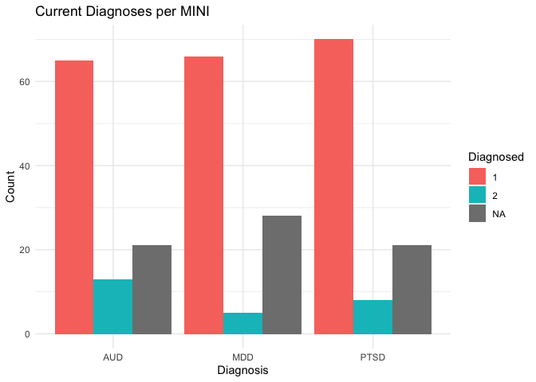<!-- -->

3.  Avoid distorting the data

The original graph produced is not extremely distorted but could be
improved. The axis ranges are good but I’ll show an example where this
can distort the data.

What I did: Y-axis inflation - By setting the y-limit to 10,00 (likely
way above actual values), you minimise visual differences, making
everything look tiny. Perception distortion - Viewers may falsely assume
diagnoses are rare or not worth attention. Undermines comparison - Tiny
differences become invisible, reducing insight.

``` r
df %>%
  select(MDD = mini_mdd_current, 
         AUD = mini_alcohol_current, 
         PTSD = mini_ptsd_current) %>%
  pivot_longer(cols = everything(), 
               names_to = "Diagnosis", 
               values_to = "Status") %>%
  group_by(Diagnosis, Status) %>%
  summarise(Count = n(), .groups = "drop") %>%
  ggplot(aes(x = Diagnosis, y = Count, fill = factor(Status))) +
  geom_bar(stat = "identity", position = "dodge", color = "black") +
  coord_cartesian(ylim = c(0, 1000)) +  # artificially large y-axis
  labs(
    title = "Deceptively Small Diagnosis Counts!",
    x = "Disorder",
    y = "Count (compressed to invisibility)",
    fill = "Diagnosed"
  ) +
  theme_minimal(base_size = 20) +
  theme(
    axis.text.x = element_text(size = 30, angle = 45, hjust = 1, face = "bold", color = "red"),
    axis.title.y = element_text(size = 10, face = "italic"),
    plot.title = element_text(size = 10, face = "bold", color = "blue")
  )
```

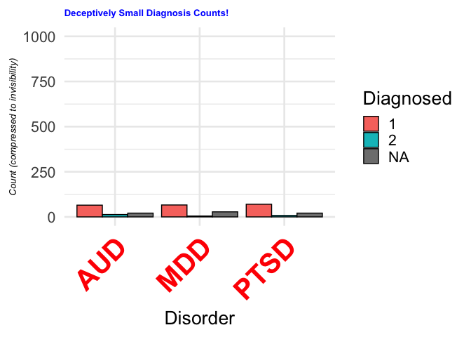<!-- -->

### BONUS: stratify the diagnoses by age bracket and make look pretty :)

``` r
# first need to specify the age groups
df$age_group <- cut(df$age, breaks = c(18, 30, 45, 60, 100), 
                    labels = c("18–29", "30–44", "45–59", "60+"), 
                    right = FALSE)
df %>%
  select(age_group, 
         MDD = mini_mdd_current, 
         AUD = mini_alcohol_current, 
         PTSD = mini_ptsd_current) %>%
  pivot_longer(cols = c(MDD, AUD, PTSD), names_to = "Diagnosis", values_to = "Status") %>%
  group_by(age_group, Diagnosis, Status) %>%
  summarise(Count = n(), .groups = "drop") %>%
  ggplot(aes(x = Diagnosis, y = Count, fill = factor(Status))) +
  geom_bar(stat = "identity", position = "dodge") +
  facet_wrap(~age_group) +
  labs(title = "Current Diagnoses by Age Group", fill = "Diagnosed") +
  theme_minimal()
```

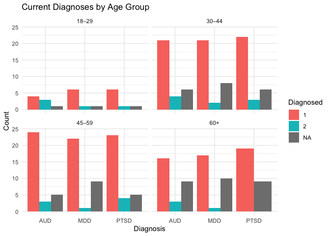<!-- -->

## Problem 1: Handling Missing Diagnoses in the data

WHile there are many methods to handle missing data, for today’s purpose
we will be transparent about the freqwuency of missingness (achieved
above).

### Solution: We will then filter the data so it is clean prior to analysis.

``` r
df_clean <- df %>%
  filter(!is.na(mini_mdd_current) & # filter the dataset to only include values WITHOUT NAs
         !is.na(mini_alcohol_current) & 
         !is.na(mini_ptsd_current))

# Total rows before cleaning
total_rows <- nrow(df)

# Total rows after removing missing
clean_rows <- nrow(df_clean)

# Rows with any missing in key diagnosis variables
missing_rows <- total_rows - clean_rows
```

## Prepare data for plotting

``` r
plot_data <- df_clean %>%
  select(MDD = mini_mdd_current, 
         AUD = mini_alcohol_current, 
         PTSD = mini_ptsd_current) %>%
  pivot_longer(cols = everything(), 
               names_to = "Diagnosis", 
               values_to = "Status") %>%
  group_by(Diagnosis, Status) %>%
  summarise(Count = n(), .groups = "drop") %>%
  group_by(Diagnosis) %>%
  mutate(Percent = round(100 * Count / sum(Count), 1),
         Label = paste0(Percent, "%"))
```

## Plot clean dataset

``` r
ggplot(plot_data, aes(x = Diagnosis, y = Count, fill = factor(Status))) +
  geom_bar(stat = "identity", position = "dodge") +
  geom_text(aes(label = Label), 
            position = position_dodge(width = 0.9), 
            vjust = -0.5, size = 5) +
  scale_fill_manual(values = c("0" = "#999999", "1" = "#0072B2"),
                    labels = c("Not Diagnosed", "Diagnosed")) +
  labs(
    title = "Current Diagnoses (Cleaned Data)",
    subtitle = paste("Missing data removed: ", missing_rows, " of ", total_rows, " cases (", 
                     round(100 * missing_rows / total_rows, 1), "%)", sep = ""),
    x = "Disorder",
    y = "Count",
    fill = "Diagnosed"
  ) +
  theme_minimal(base_size = 16)
```

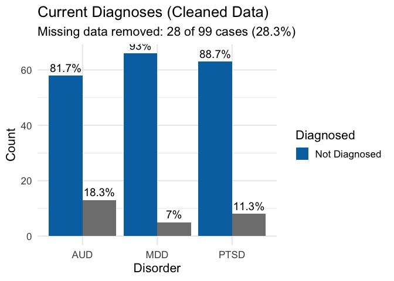<!-- -->

# Continuous data: Diagnosing and Curing Outliers

This is data that has been pre-cleaned so I will not go through this
process as it follows principles described above. We gave individuals
with TBI an online survey containing a battery of psychological scales.
We can use this data to explore severity of different psychopathologies.
First, I will visualise it in a few different ways (choose your fave!).
Then, I will explore how we can identify outliers visually (and maybe
statistically if time!).

For those with further interest, I handled missing data for these
variables using mean imputation. I did not delete individuals in a
listwise fashion as I needed to preserve power in the sample size as
much as possible.

``` r
# don't worry about this step - I re-standardised the data as it is a composite psychological score. 
df$General_Problems <- scale(df$a1_composite_score) # this creates a new variable in the dataset

## what's in our variable of interest
df$General_Problems
```

    ##                [,1]
    ##   [1,] -1.037752856
    ##   [2,]  0.763324030
    ##   [3,] -0.576026207
    ##   [4,] -0.796777853
    ##   [5,]  0.024810377
    ##   [6,]           NA
    ##   [7,] -0.436355171
    ##   [8,] -0.866002401
    ##   [9,] -0.963437890
    ##  [10,] -0.859129278
    ##  [11,] -0.644010609
    ##  [12,] -0.405640253
    ##  [13,]           NA
    ##  [14,]  0.676749225
    ##  [15,] -1.339581536
    ##  [16,]  0.080912698
    ##  [17,]  2.333590318
    ##  [18,]  1.655310083
    ##  [19,] -1.003212681
    ##  [20,]  0.392087824
    ##  [21,] -1.428908295
    ##  [22,]  0.457524552
    ##  [23,]  1.938823021
    ##  [24,] -0.022135820
    ##  [25,] -0.331010770
    ##  [26,] -0.660789044
    ##  [27,]  4.519659195
    ##  [28,] -0.411340862
    ##  [29,]  0.554428364
    ##  [30,] -0.286988236
    ##  [31,]  1.347289932
    ##  [32,]  0.819819900
    ##  [33,] -0.304134963
    ##  [34,] -0.894710306
    ##  [35,]           NA
    ##  [36,]  0.330829830
    ##  [37,] -0.696262280
    ##  [38,] -0.977077743
    ##  [39,]  0.573712091
    ##  [40,]  0.850583411
    ##  [41,]  1.659070983
    ##  [42,]  0.340507594
    ##  [43,] -0.274828658
    ##  [44,] -0.916547688
    ##  [45,] -0.600225499
    ##  [46,] -0.545110956
    ##  [47,]  1.737609650
    ##  [48,]  1.602112206
    ##  [49,]  0.823637634
    ##  [50,] -1.613709847
    ##  [51,] -1.176635480
    ##  [52,]  0.799711376
    ##  [53,] -0.901082621
    ##  [54,] -0.169888501
    ##  [55,]  1.080390201
    ##  [56,]           NA
    ##  [57,] -0.487681046
    ##  [58,]  0.131203443
    ##  [59,] -1.001721762
    ##  [60,] -0.744740363
    ##  [61,] -0.007654286
    ##  [62,]  1.096724718
    ##  [63,]  0.901912652
    ##  [64,] -0.624523358
    ##  [65,]  0.262918559
    ##  [66,] -0.743515520
    ##  [67,] -1.010817452
    ##  [68,]  0.992938168
    ##  [69,]  0.156792776
    ##  [70,] -0.879283672
    ##  [71,] -0.682513866
    ##  [72,] -1.027323578
    ##  [73,]  0.320986858
    ##  [74,]  0.141393885
    ##  [75,]  0.911819623
    ##  [76,]  0.148259009
    ##  [77,] -0.631766350
    ##  [78,] -1.028851784
    ##  [79,]  0.332754840
    ##  [80,]  0.621064228
    ##  [81,]  0.294500829
    ##  [82,]  0.125522816
    ##  [83,] -0.198116820
    ##  [84,] -1.429666346
    ##  [85,]  1.213884691
    ##  [86,]  0.109482503
    ##  [87,]  0.711583982
    ##  [88,]  0.115678796
    ##  [89,]           NA
    ##  [90,] -0.434608119
    ##  [91,] -0.844966204
    ##  [92,]           NA
    ##  [93,] -0.674393726
    ##  [94,]  0.023030322
    ##  [95,]  0.356642775
    ##  [96,]  1.876704570
    ##  [97,] -0.573971963
    ##  [98,] -1.055416937
    ##  [99,] -0.987447083
    ## attr(,"scaled:center")
    ## [1] -0.1771162
    ## attr(,"scaled:scale")
    ## [1] 28.42624

NOTE: General Problems is a psychological construct representing an
overarching “p-factor” that reflects a general tendency towards
experiencing a range of psychological problems.

## Plotting Options

### Histogram — Distribution Overview

``` r
ggplot(df, aes(x = General_Problems)) +
  geom_histogram(binwidth = 0.5, fill = "#0072B2", color = "white") +
  labs(title = "Distribution of General Problems",
       x = "Standardized Score",
       y = "Count") +
  theme_minimal()
```

    ## Warning: Removed 6 rows containing non-finite outside the scale range
    ## (`stat_bin()`).

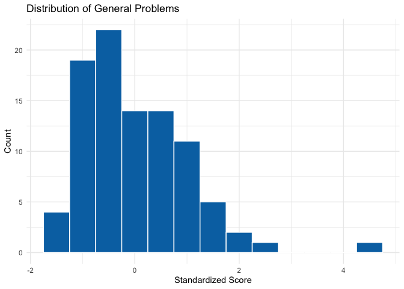<!-- -->

## Outlier Detection

Since it’s standardised (mean ≈ 0, SD ≈ 1), values beyond ±2 or ±3 SD
are often flagged as potential outliers.

### Boxplot — Classic Outlier Detection

- Outliers are values below Q1 - 1.5 × IQR or above Q3 + 1.5 × IQR
- These appear as points outside the whiskers

``` r
ggplot(df, aes(y = General_Problems)) +
  geom_boxplot(fill = "#56B4E9") +
  labs(title = "Boxplot of General Problems",
       y = "Standardized Score (Z)") +
  theme_minimal()
```

    ## Warning: Removed 6 rows containing non-finite outside the scale range
    ## (`stat_boxplot()`).

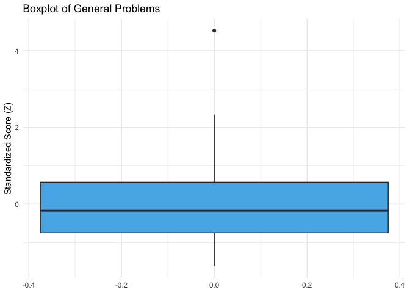<!-- -->

### Density Plot — Smoothed Distribution

``` r
ggplot(df, aes(x = General_Problems)) +
  geom_density(fill = "#56B4E9", alpha = 0.6) +
  labs(title = "Density of General Problems",
       x = "Standardized Score",
       y = "Density") +
  theme_minimal()
```

    ## Warning: Removed 6 rows containing non-finite outside the scale range
    ## (`stat_density()`).

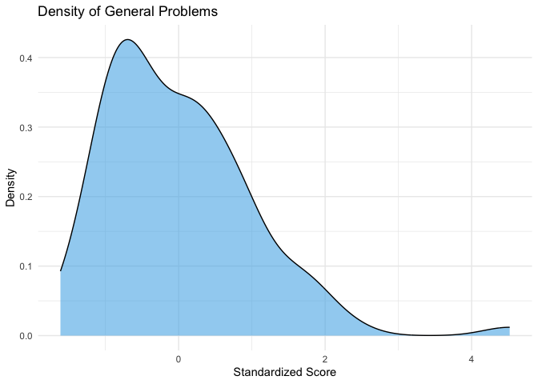<!-- -->

### Histogram or Density Plot with Threshold Lines

Shows where outliers fall relative to the main distribution.

``` r
ggplot(df, aes(x = General_Problems)) +
  geom_histogram(binwidth = 0.5, fill = "#0072B2", color = "white", alpha = 0.7) +
  geom_vline(xintercept = c(-2, 2), linetype = "dashed", color = "red", size = 1) +
  labs(title = "Histogram of General Problems with Outlier Thresholds",
       x = "Standardized Score",
       y = "Count") +
  theme_minimal()
```

    ## Warning: Using `size` aesthetic for lines was deprecated in ggplot2 3.4.0.
    ## ℹ Please use `linewidth` instead.
    ## This warning is displayed once every 8 hours.
    ## Call `lifecycle::last_lifecycle_warnings()` to see where this warning was
    ## generated.

    ## Warning: Removed 6 rows containing non-finite outside the scale range
    ## (`stat_bin()`).

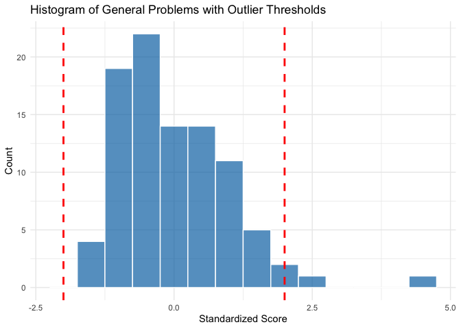<!-- -->

### Bonus: Get Outlier List in Code

``` r
outliers <- df %>% filter(abs(General_Problems) > 2)
```

    ## Warning: Using one column matrices in `filter()` was deprecated in dplyr 1.1.0.
    ## ℹ Please use one dimensional logical vectors instead.
    ## This warning is displayed once every 8 hours.
    ## Call `lifecycle::last_lifecycle_warnings()` to see where this warning was
    ## generated.

``` r
print(outliers)
```

    ## # A tibble: 2 × 1,593
    ##      id  mode participant_id_complete eligibility explanatory_statement_complete
    ##   <dbl> <dbl>                   <dbl>       <dbl>                          <dbl>
    ## 1    17     1                       2           1                              2
    ## 2    28     1                       2           1                              2
    ## # ℹ 1,588 more variables: background_information_timestamp <chr>,
    ## #   no_head_injuries <dbl>, accomodation <dbl>, accom_other <chr>,
    ## #   employment <dbl>, relationship <dbl>, sensory___1 <dbl>, sensory___2 <dbl>,
    ## #   sensory___3 <dbl>, sensory___4 <dbl>, sensory___5 <dbl>, sensory___6 <dbl>,
    ## #   sensory___7 <dbl>, sensory___8 <dbl>, psych_hx___1 <dbl>,
    ## #   psych_hx___2 <dbl>, psych_hx___3 <dbl>, psych_hx___4 <dbl>,
    ## #   psych_hx___5 <dbl>, psych_hx___6 <dbl>, psych_hx___7 <dbl>, …

## Curing Outliers

### Option 1: Keep Them (this is what I did in my study). While it is honest to the data, it can in some cases affect analyses.

### Option 2: Remove Outliers

``` r
df_no_outliers <- df %>% filter(abs(General_Problems) <= 2)
```

### Option 3: Run analyses with and without outliers and see if it affects it.

``` r
df <- df %>%
  mutate(outlier_flag = abs(General_Problems) > 2)


df %>%
  group_by(outlier_flag) %>%
  summarise(
    n = n(),
    mean_gp = mean(General_Problems, na.rm = TRUE),
    sd_gp = sd(General_Problems, na.rm = TRUE)
  )
```

    ## # A tibble: 3 × 4
    ##   outlier_flag[,1]     n  mean_gp  sd_gp
    ##   <lgl>            <int>    <dbl>  <dbl>
    ## 1 FALSE               91  -0.0753  0.854
    ## 2 TRUE                 2   3.43    1.55 
    ## 3 NA                   6 NaN      NA

``` r
ggplot(df, aes(x = General_Problems, fill = outlier_flag)) +
  geom_histogram(position = "identity", alpha = 0.5, bins = 30) +
  scale_fill_manual(values = c("FALSE" = "#0072B2", "TRUE" = "#D55E00"),
                    labels = c("Non-Outliers", "Outliers")) +
  labs(title = "General Problems Distribution",
       subtitle = "Showing Impact of Outliers",
       fill = "Outlier?",
       x = "General Problems (Z-score)",
       y = "Count") +
  theme_minimal()
```

    ## Warning: Removed 6 rows containing non-finite outside the scale range
    ## (`stat_bin()`).

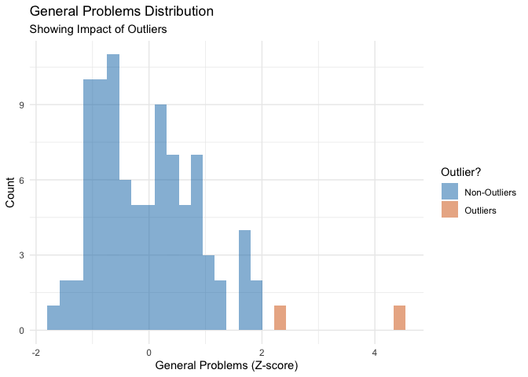<!-- -->

## Synergystic Visualisatio: Using Two or More Variables

### Boxplots by Group — Compare Across Diagnoses or Gender

Example: By MDD diagnosis

``` r
df_clean$General_Problems <- scale(df_clean$a1_composite_score)
ggplot(df_clean, aes(x = factor(mini_mdd_current), y = General_Problems)) +
  geom_boxplot(fill = "#E69F00") +
  labs(title = "General Problems by MDD Diagnosis",
       x = "MDD Diagnosis (1 = No, 2 = Yes)",
       y = "General Problems (Z-Score)") +
  theme_minimal()
```

    ## Warning: Removed 2 rows containing non-finite outside the scale range
    ## (`stat_boxplot()`).

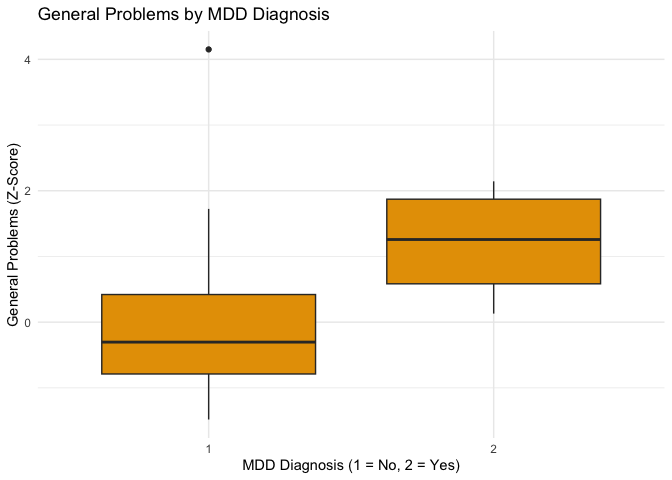<!-- -->

### Violin Plot — Combine Density + Boxplot

``` r
ggplot(df_clean, aes(x = factor(mini_mdd_current), y = General_Problems)) +
  geom_violin(fill = "#009E73", alpha = 0.7) +
  geom_boxplot(width = 0.1, fill = "white") +
  labs(title = "General Problems by MDD Diagnosis",
       x = "MDD Diagnosis",
       y = "General Problems (Standardized)") +
  theme_minimal()
```

    ## Warning: Removed 2 rows containing non-finite outside the scale range
    ## (`stat_ydensity()`).

    ## Warning: Removed 2 rows containing non-finite outside the scale range
    ## (`stat_boxplot()`).

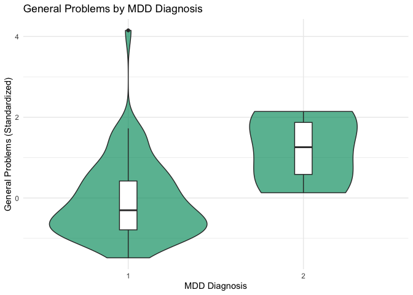<!-- -->

### Scatter Plot — General Problems vs Age

``` r
ggplot(df_clean, aes(x = age, y = General_Problems)) +
  geom_point(alpha = 0.3) +
  geom_smooth(method = "lm", color = "red") +
  labs(title = "General Problems vs Age",
       x = "Age",
       y = "General Problems") +
  theme_minimal()
```

    ## `geom_smooth()` using formula = 'y ~ x'

    ## Warning: Removed 2 rows containing non-finite outside the scale range
    ## (`stat_smooth()`).

    ## Warning: Removed 2 rows containing missing values or values outside the scale range
    ## (`geom_point()`).

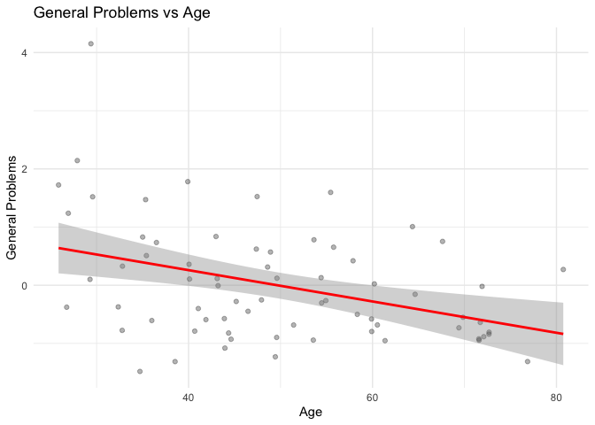<!-- -->

### Raincloud Plot (Optional, Modern & Informative)

``` r
library(ggdist)
```

    ## Warning: package 'ggdist' was built under R version 4.0.5

``` r
ggplot(df_clean, aes(x = factor(mini_ptsd_current), y = General_Problems)) +
  stat_halfeye(adjust = 0.5, width = 0.6, .width = 0, fill = "#D55E00") +
  geom_boxplot(width = 0.1, outlier.shape = NA) +
  geom_jitter(width = 0.1, alpha = 0.2) +
  labs(title = "Raincloud Plot: General Problems by PTSD Diagnosis",
       x = "PTSD Diagnosis",
       y = "General Problems") +
  theme_minimal()
```

    ## Warning: Removed 2 rows containing missing values or values outside the scale range
    ## (`stat_slabinterval()`).

    ## Warning: Removed 2 rows containing non-finite outside the scale range
    ## (`stat_boxplot()`).

    ## Warning: Using the `size` aesthetic with geom_segment was deprecated in ggplot2 3.4.0.
    ## ℹ Please use the `linewidth` aesthetic instead.
    ## This warning is displayed once every 8 hours.
    ## Call `lifecycle::last_lifecycle_warnings()` to see where this warning was
    ## generated.

    ## Warning: Removed 2 rows containing missing values or values outside the scale range
    ## (`geom_point()`).

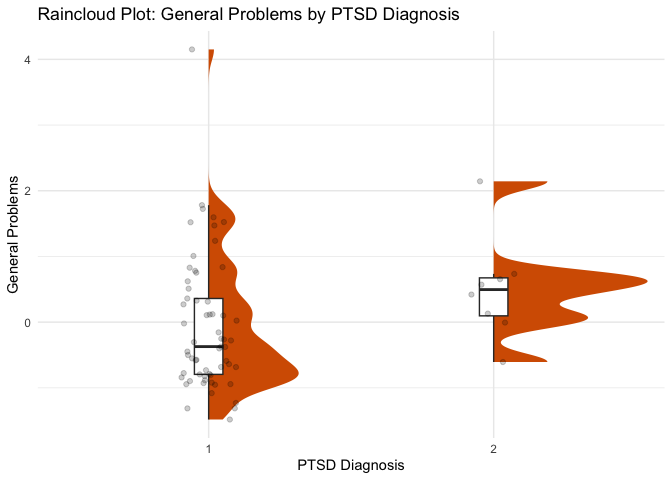<!-- -->

Thank you! <alexia.samiotis1@monash.edu>
